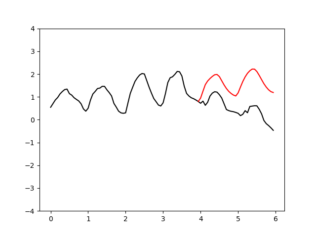
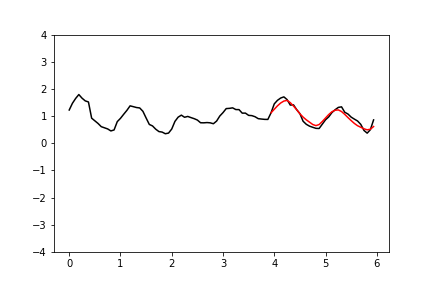
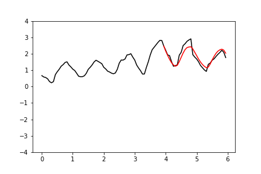

Auto-regressive forecasting with WaveNet
=========

This script uses a [WaveNet](https://arxiv.org/abs/1609.03499)-inspired auto-regressive model
to forecast the variation of air temperature over time.

When predicting the air temperature for the next time step, a model should take into account
the temperature at the current time step, and also whether the temperature is likely to rise or fall.
The latter depends on what time of day it is, which can be inferred from the
periodic temperature fluctuations over the preceding period.

I decided to use WaveNet for this exercise, but I didn't really need to.
The sampling frequency is quite low, so standard 1D CNNs or RNN should work just as well
(and indeed they do - see [here](https://github.com/kenny-wong137/deep-learning-exercises/tree/dev/timeseries)
for a non-autogressive model using 1D CNNs or RNNs).
Nonetheless, it's fun to implement a WaveNet model, and it's nice to see that it is so easy to implement one in Tensorflow.

**Sample forecasts**

 

 
