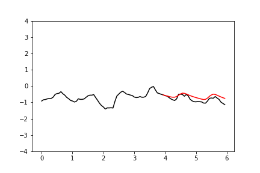

Auto-regressive forecasting with WaveNet
=========

This script uses a [WaveNet](https://arxiv.org/abs/1609.03499)-inspired auto-regressive model
to forecast the variation of air temperature over time.

To successfully predict the air temperature at the next time step, a model should take into account several factors,
which include the temperature at the current time step, and also whether the temperature is likely to rise or fall.
Whether the temperature is likely to rise or fall depends on what time of day it is, and this can be inferred from the
pattern of periodic temperature fluctuations over the preceding period.

I decided to use WaveNet for this exercise. WaveNet is a 1-dimensional CNN, which uses atrous convolutions to
increase the receptive field for a prediction at a given time step. With `N` convolutional layers, the
CNN prediction at a given time step is receptive to the inputs at the preceding `2^N` time steps. The `i`th convolution
layer uses a kernel with dilation factor of `2^i`, so that dependency graph for the prediction at a given time step
forms a tree like structure.

Perhaps using WaveNet for this problem is overkill. Given how low the sampling frequency is in the data,
a standard LSTM is also able to capture the long-term dependencies. (See the images for examples of predictions made by LSTMs.)
Nonetheless, it's fun to learn how to implement a WaveNet architecture in Tensorflow!

**Sample forecasts**

 

 
