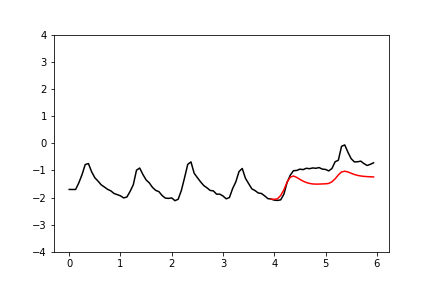
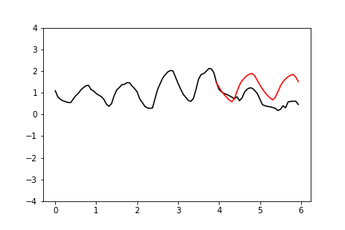
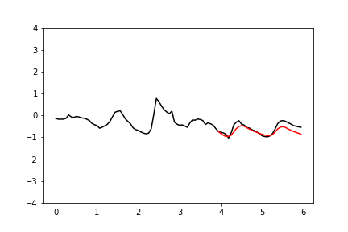

Auto-regressive forecasting with WaveNet
=========

This script uses a [WaveNet](https://arxiv.org/abs/1609.03499)-inspired auto-regressive model
to forecast air temperatures over time.

When predicting the air temperature at the next timestep,
a good model should be able to interpret the temperature fluctuations over previous timesteps
to infer what time of day it is currently.

Of course, I don't have to use WaveNet.
The sampling frequency is quite low, so standard 1D CNNs or RNN should work just as well (and indeed they do).
Nonetheless, it's fun to implement a WaveNet model - I don't get to do it every day!

**Sample forecasts**

