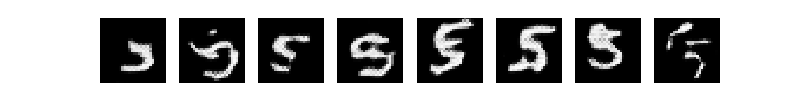
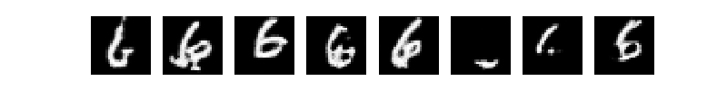

Wasserstein GAN with gradient penalty
========

In this script, I learn how to implement the [WGAN-GP](https://arxiv.org/pdf/1704.00028.pdf).
The WGAN-GP is similar to a standard GAN, except for the choice of loss function and the training mechanism.
It is usually more stable at training time, and is less sensitive to the choice of hyperparameters.

**Sample generated images**

Trained on MNIST digits (of course)!

The WGAN-generated images are not as clean as the images I once generated with a
[variational autoencoder](https://github.com/kenny-wong137/deep-learning-exercises/tree/dev/vae),
but to be fair, there is a decent amount of variation between the different images generated by the WGAN for each digit,
which is nice to see.

