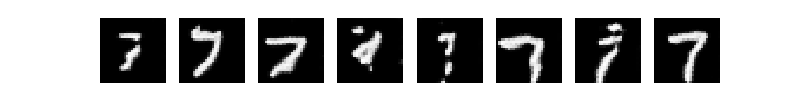

Wasserstein GAN with gradient penalty
========

In this script, I learn how to implement the [WGAN-GP](https://arxiv.org/pdf/1704.00028.pdf),
and use it to generate digits in the style of the MNIST digits.

The WGAN-GP is similar in concept to a standard GAN. The main difference is in the choice of loss function and the training mechanism.
When training a standard GAN, one needs to carefully balance the learning rates of the generator and the discriminator
so that the discriminator doesn't become too strong before the generator gets a chance to improve.
When training a WGAN, this is not an issue: in between each generator training step, the discriminator
is trained to convergence.

**Sample generated images**

I have predicted some sample generated images for each of the MNIST digits.

The WGAN-generated images are not as clean as the images I once generated with a variational autoencoder, which is a little disappointing.
But to be fair, the digits are recognisable,
and there is a decent amount of variation between the different images generated by the WGAN for each digit.

