Object localization
==========

We train our object localization model on the [Oxford pets dataset](https://www.robots.ox.ac.uk/~vgg/data/pets/).
The dataset contains 3000 images, each of which contains a *single* instance of a cat or dog.
The task is to predict a bounding box around the animal's head.

**Methodology**

The approach is inspired by ideas from [YOLO](https://arxiv.org/abs/1506.02640) and
[Faster R-CNN](https://arxiv.org/abs/1506.01497).

We divide the image space into a 5x5 grid. On each grid cell, we place four anchor boxes of different sizes.
We train a model to predict, for each of the 100 anchor boxes:
* What is the intersection-over-union (IoU) between the anchor box and the true bounding box?
* What the offset between the true bounding box and the anchor box
(i.e. what are the offsets between the x-centre coordinates and between the y-centre coordinates,
and what are the ratios between the widths and between the heights)?
We only care about predicting these offsets accurately when the IoU between the anchor box and true box is high,
and so we weight the loss term for the offset prediction by the IoU.

At inference time, the offset predictor gives us 100 predicted bounding boxes - one per anchor.
Our final prediction is an average of these predictions, weighted by the square of the predicted IoUs.
Thus predictions corresponding to anchor boxes that we believe to be better aligned with the true bounding box
are weighted more highly.

The architecture is a CNN, where the base feature extractor is a pretrained
[MobileNetV2](https://github.com/tensorflow/models/tree/master/research/slim/nets/mobilenet) architecture.
Some of the data preprocessing code is based on [this resource](https://github.com/lars76/object-localization).

**Sample predictions**

The red boxes are the predicted bounding boxes and the blue boxes are ground truth.

The results are not amazing, but at least I think they are somewhat better than random!
I may have another go at this task in future, with more training data and with a GPU...

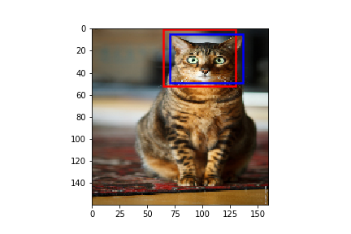
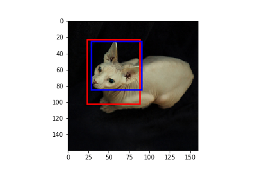
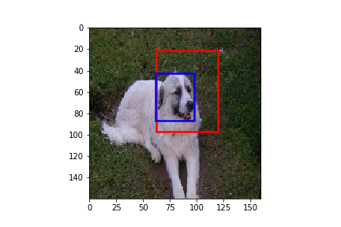
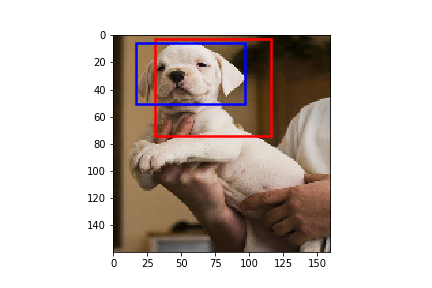
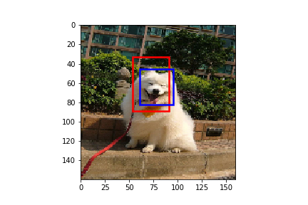
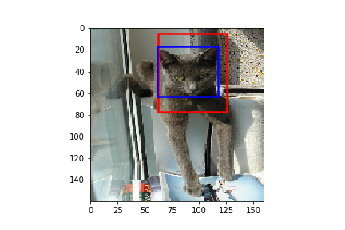
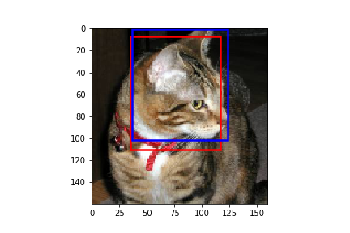
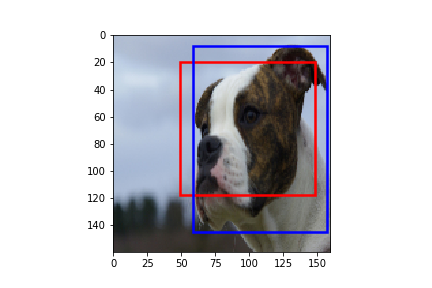
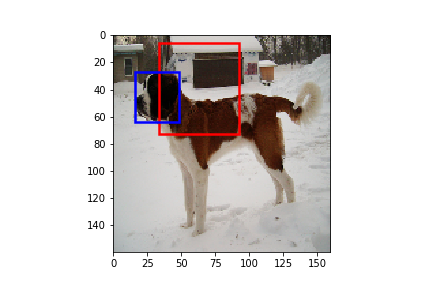
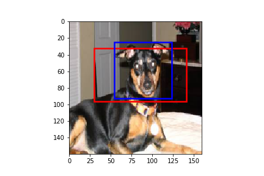
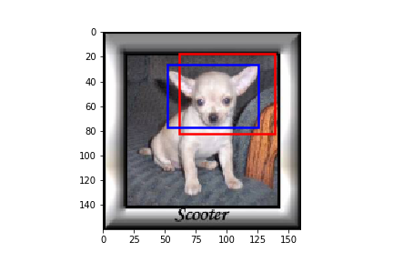
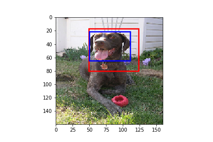
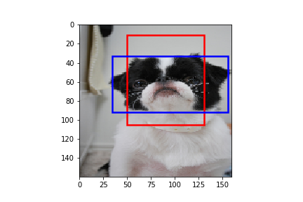
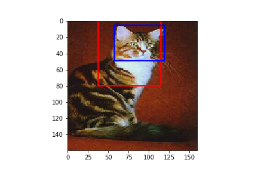
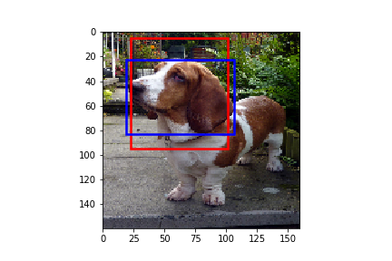
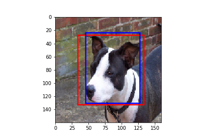
